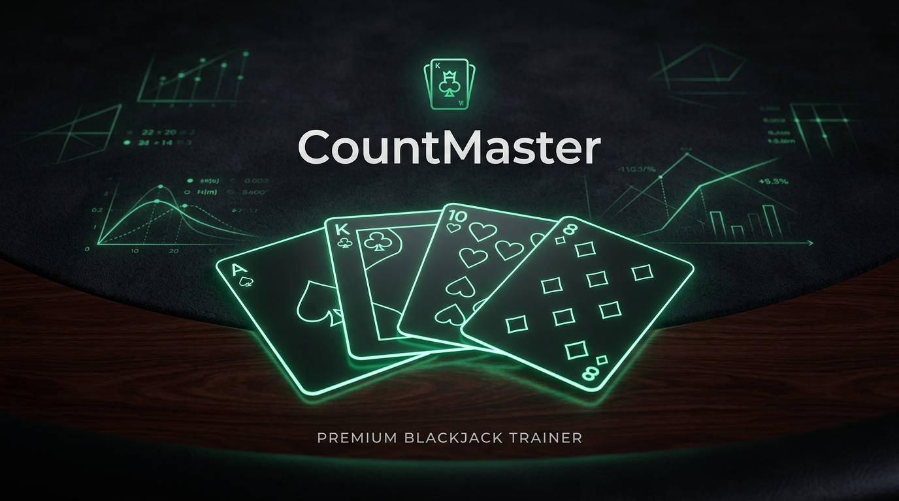

# CountMaster Blackjack Trainer

CountMaster is a high-fidelity, desktop-optimized Blackjack Card Counting Simulator and Cognitive Trainer. Engineered as a professional-grade cognitive gymnasium, it allows memory athletes and serious players to hone mathematical estimation skills, card tracking speeds, and basic strategy adherence under simulated real-world casino constraints with zero monetary risk.

---

##  Core Design Philosophy

*   **Zero-Noise Interface:** Focused strictly on sensory training. No advertisements, no transactional clutter, and no visual-distraction layers.
*   **Aesthetic Fidelity:** Dark-felt radial emerald gradients simulate a premium, high-stakes physical room environment.
*   **Hardware Accelerated:** Fluid dealing animations and responsive layout transitions powered by **Framer Motion**.
*   **Offline-Ready Precision:** Relies on local memory constructs and highly responsive state-propagation models so you can train latency-free.

---

##  Main Capabilities

### 1. Advanced Simulation Modes
*   **Standard Mode (Infinite Shoe):** Continuous randomized card distribution. Focuses purely on long-term endurance, instant reflex-checking, and raw numerical retention.
*   **Advanced Mode (Shoe Penetration):** Uses fixed physical shoes (configurable up to 8 decks) with live card-penetration tracking inside a visual **Discard Tray**. Once deck depletion limit is crossed, reshuffling is enforced, mimicking land-based casino mechanics.

### 2. Live Automated Environment
*   **Configurable Multi-Seat Actions:** Support for up to 5 simulated players seated at the table playing alongside you. Automated bots execute flawless basic strategy real-time.
*   **Dynamic Dealing Intervals:** Configurable dealing speed limits (from slow deliberate practice to high-speed reflex drills) to calibrate mathematical capture thresholds.
*   **True-Count Drill Inputs:** Interactive popovers halt play rounds to test your accumulated running count. Provides instant mathematical grading and tracking diagnostics.

---

##  Mathematical Core: The Hi-Lo Strategy

CountMaster operates using the **Hi-Lo system**—the globally recognized system for card estimation. Every single card passing across the felt holds a assigned count-value:

| Card Rank | Category | Count-Value | Impact on Edge |
| :--- | :--- | :---: | :--- |
| **2, 3, 4, 5, 6** | Low Cards | **+1** | Increases player advantage when removed from deck |
| **7, 8, 9** | Neutral Cards | **0** | No impact on mathematical advantage |
| **10, J, Q, K, A** | High Cards | **-1** | Decreases player advantage when removed from deck |

### Mathematical Concepts Applied:
*   **Running Count:** The ongoing sum of the values of all cards that have been dealt since the last shuffle.
*   **Discard Deck Estimation:** Users must observe deck penetration inside the discard tray to correctly convert their *Running Count* into a *True Count* (Crucial for multi-deck shoes).

---

##  Stack & Architecture

CountMaster is built utilizing professional-grade, modern front-end technologies focusing on high performance and responsive render pipelines:

*   **Runtime Framework:** [React 19](https://react.dev/) (Functional Components & Hooks)
*   **Language Syntax:** [TypeScript](https://www.typescriptlang.org/) (Strict Type-Definitions & Static Checking)
*   **Bundling/Hot-Reload Engine:** [Vite](https://vite.dev/)
*   **Styling Engine:** [Tailwind CSS](https://tailwindcss.com/)
*   **Animation Orchestration:** [Framer Motion](https://www.framer.com/motion/)
*   **Vector Icon System:** [Lucide React](https://lucide.dev/)

---

##  Local Installation & Development

To clone, test, and run CountMaster inside your local development sandbox:

### Prerequisites
*   Node.js (v18.0 or higher recommended)
*   npm or Yarn

### Step-by-Step Instructions

1.  **Clone down the repository directory:**
    ```bash
    git clone https://github.com/your-username/countmaster-blackjack-trainer.git
    cd countmaster-blackjack-trainer
    ```

2.  **Install project dependencies:**
    ```bash
    npm install
    ```

3.  **Boot up Vite developer server:**
    ```bash
    npm run dev
    ```
    *The local test interface will be served at `http://localhost:3000` or the port allocated by your environment.*

4.  **Enforce code-quality linter scans:**
    ```bash
    npm run lint
    ```

5.  **Compile static artifact bundles for production:**
    ```bash
    npm run build
    ```
    *Vite will produce highly compressed static files inside the `/dist` directory ready for any server host.*

---

##  Production Deployment (Vercel Configuration)

CountMaster is customized for zero-configuration, seamless deployment on **Vercel** or alternative cloud edge routers.

The repository includes a standalone `vercel.json` rewrite configuration at the root of the project to cleanly support single-page-routing (`react-router-dom`) without encountering `404 Not Found` errors when refreshing paths (e.g., `/about`):

```json
{
  "rewrites": [
    {
      "source": "/(.*)",
      "destination": "/"
    }
  ]
}
```

---

##  Educational Disclosure

This platform is developed exclusively as a **cognitive and memory-training training program**. It contains **no gambling elements, no currency conversions, and no actual risk models**. CountMaster does not encourage, facilitate, or endorse real-money casino gaming. Memory training and basic strategy adherence are mathematical constructs and do not guarantee profits or eliminate the house edge in live land-based casinos. Play wisely.
